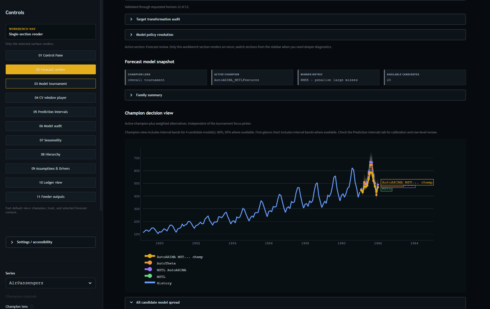
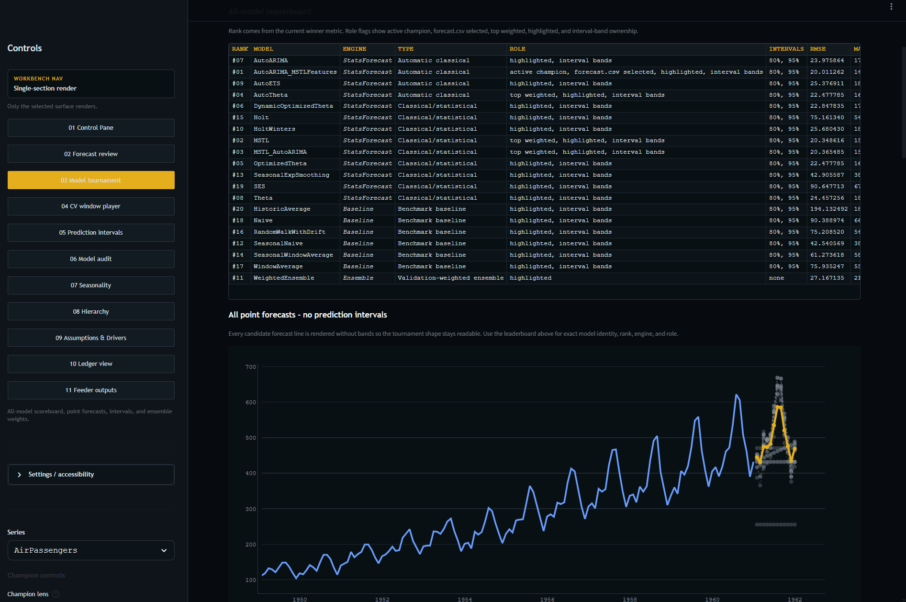
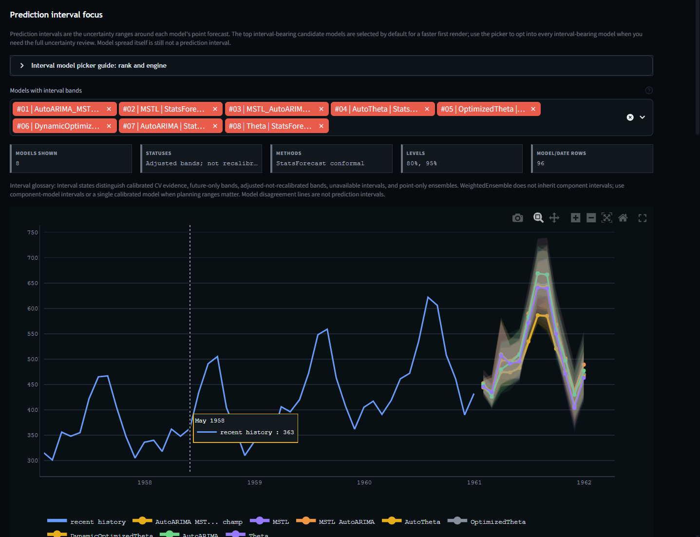
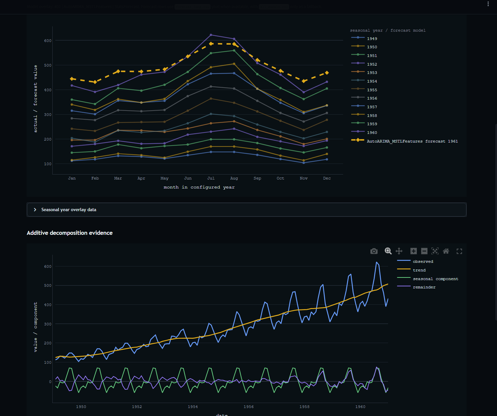
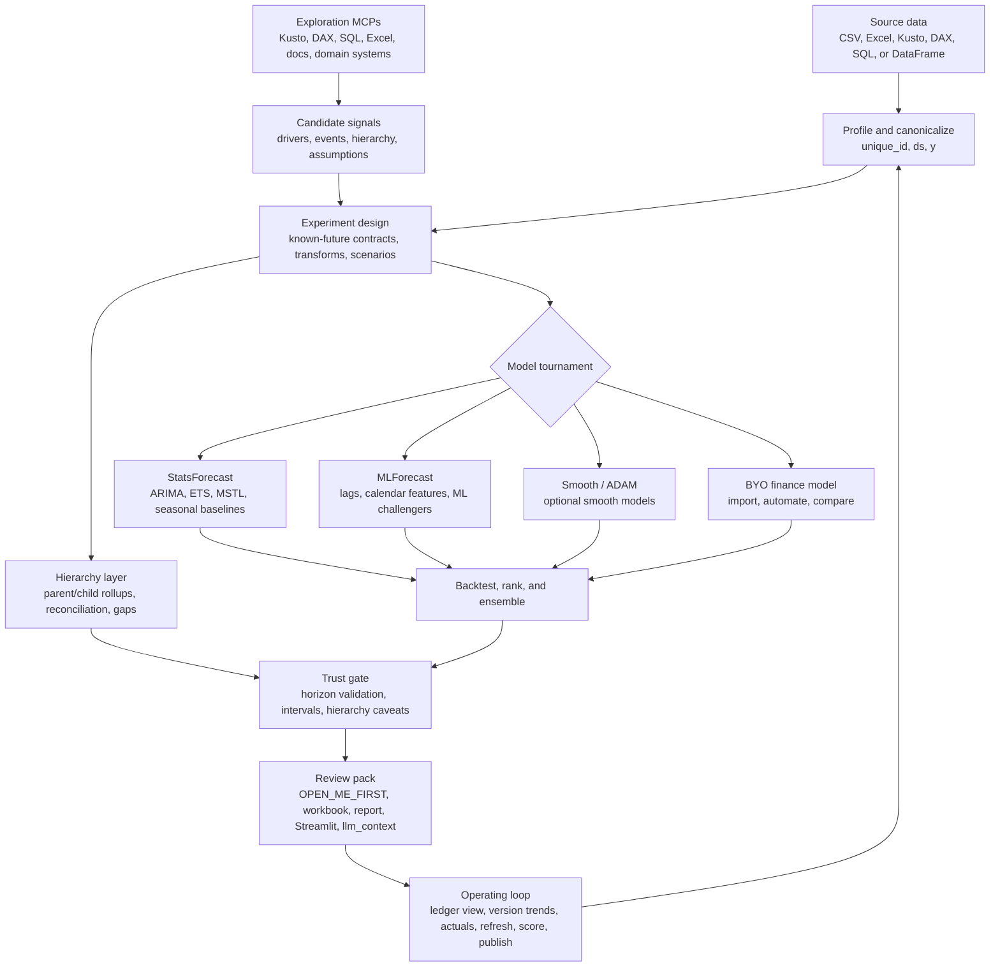

# nixtla-scaffold

[](https://pypi.org/project/nixtla-scaffold/)

Simple, explainable Nixtla forecasting scaffolding for finance users and AI agents.

`nixtla-scaffold` turns a small time-series table into forecast outputs that are easy to review, explain, and hand to another analyst or agent. It is built for the messy middle between "quick model demo" and "finance-ready operating loop": profile the data, run sensible model candidates, expose the evidence, and package the results.



## What it does

| Feature | Why it matters |
| --- | --- |
| **Fast forecast runs** | Start from a CSV or workbook with `unique_id`, `ds`, and `y`; single-series files can omit `unique_id`. |
| **Model tournament** | Runs simple baselines plus StatsForecast candidates by default, with optional MLForecast, smooth ADAM, hierarchy, custom challengers, BYO finance models, and advisory ensemble labs. |
| **Trust-first outputs** | Shows model evidence, interval status, horizon validation, caveats, and next actions instead of pretending every forecast is planning-ready. |
| **Finance-friendly review** | Writes a clean HTML landing page, Excel workbook, selected forecast CSV, model card, diagnostics, and Streamlit app. |
| **Accuracy research** | Use bounded source discovery to generate falsifiable hypotheses, reviewer-gate each experiment, and confirm only the best candidate on untouched later data. |
| **Hierarchy and reconciliation** | Forecast parent/child rollups, reconcile coherent totals, and surface gaps before planning use. |
| **Forecast operating loop** | Track versions, landed actuals, drift, and forecast trends over time in the ledger view. |
| **Optional FINN bridge** | Canonicalize, compare, and score FINN/finnts R outputs as advisory external forecasts without making R a default dependency. |
| **Agent handoff** | Produces `llm_context.json` for each run and ships a forecasting skill for AI agents. |

## Workbench views

| Model tournament | Prediction intervals |
| --- | --- |
|  |  |
| **Seasonality** | **Forecast review** |
|  |  |

## Five-minute forecast

Install the CLI:

```powershell
uv tool install nixtla-scaffold
```

Run a profile and forecast:

```powershell
nixtla-scaffold profile --input examples\monthly_finance_csv\input.csv
nixtla-scaffold forecast --input examples\monthly_finance_csv\input.csv --preset standard --horizon 6 --levels 80 95 --output runs\demo
```

Open `runs\demo\OPEN_ME_FIRST.html` first. It points to the clean workbook, static report, selected forecast, Streamlit app, and LLM handoff packet.

## The mental model



Think of it as a forecast workbench, not a single model. Use the right MCP or query tool to explore source data and candidate regressors, turn only trusted known-future signals into experiments, let the tournament compare statistical, ML, smooth, hierarchy, and BYO finance-model paths, then use the ledger view to track forecast versions, trends, and actuals as the operating loop matures.

## Input shape

Use a long table:

| unique_id | ds | y |
| --- | --- | --- |
| Revenue | 2024-01-31 | 100000 |
| Revenue | 2024-02-29 | 104000 |

Finance exports can keep business column names:

```powershell
nixtla-scaffold forecast --input plan.xlsx --sheet Data --id-col Product --time-col Month --target-col Revenue --preset standard --horizon 6 --output runs\plan
```

## Presets

| Preset | Use when |
| --- | --- |
| `quick` | You need a fast exploratory read or smoke run; it is non-promotable. |
| `accuracy-first` | You want bounded context discovery, serious native candidates, full-horizon validation when feasible, explicit planning-readiness gates, and chronological promotion evidence. |
| `standard` | You need the normal serious finance forecast. |
| `strict` | The forecast feeds a high-stakes decision and should require stronger validation. |
| `hierarchy` | Parent and child planning totals need to tie. |

## Outputs to open first

| File | Use it for |
| --- | --- |
| `OPEN_ME_FIRST.html` | Clean landing page with the best next files. |
| `output\forecast_review.xlsx` | Compact workbook for analyst review. |
| `forecast.csv` | Selected forecast rows with horizon and interval guardrails. |
| `report.html` | Static review report with evidence and caveats. |
| `streamlit_app.py` | Interactive local dashboard. |
| `llm_context.json` | Single-file handoff packet for an LLM or agent. |
| `appendix\context_receipt.json` | Accuracy-first intake, source-discovery provenance, and candidate-driver dispositions. |
| `appendix\research_budget.json` | Selected hard research bounds plus known consumption and remaining budget. |
| `appendix\accuracy_gate.json` | Authoritative `planning_ready`, `directional_only`, or `blocked` claim decision with remediation. |
| `appendix\signal_needs.json` | Diagnosis-led information needs and whether source discovery is complete. |
| `appendix\signal_probe_ledger.jsonl` | Append-only bounded source probes with capability, query count, provenance, and result. |
| `appendix\signal_contracts.json` | Validated context/scenario/regressor/reject dispositions with grain, vintage, leakage, and future-value contracts. |
| `appendix\hierarchy_rollup.csv` | Parent/child rollup coverage and reconciliation gaps when hierarchy is enabled. |
| `appendix\ensemble_policy_receipts.csv` | Advisory ensemble policy receipts; extra ensemble artifacts are written when `--ensemble-policy` is requested. |
| `research_plan.json` | Optimizer budget, tuning/confirmation policy, hypothesis queue, and baseline contract. |
| `iteration_ledger.csv` | One row per attempted hypothesis with cost, evidence, reviewer status, and disposition. |
| `promotion_decision.json` | Advisory decision from exact tuning evidence and untouched confirmation; never mutates the official forecast. |
| `stop_receipt.json` | Why research stopped, budget consumed/remaining, best candidate, and unresolved evidence gaps. |
| `signal_experiment_dispositions.json` | Whether each admitted signal was queued, tested, blocked, or not applicable, with an explicit reason. |
| `.github\agents\finn-forecast-analyst.agent.md` | Repo-level Copilot custom-agent profile for FINN/scaffold review workflows. |

For an accuracy-first run, start with `setup`, complete the generated
`forecast_context.json` using bounded read-only source discovery, then run the
generated command. If context or validation evidence is incomplete, the package
still produces a directional baseline when technically possible but prevents a
planning-ready claim.

## Accuracy-first experiments

`experiment` tests one named hypothesis. `optimize` runs a bounded sequence of
evidence-led hypotheses and reserves the latest eligible horizon block(s) for
confirmation before any candidate is ranked.

```powershell
# Generate the queue from forecast evidence and the declared context budget.
nixtla-scaffold optimize --input data.csv --preset accuracy-first --context-file forecast_context.json --horizon 6 --output runs\accuracy_research

# Run one attributable transform hypothesis.
nixtla-scaffold experiment --input data.csv --preset accuracy-first --context-file forecast_context.json --horizon 6 --variants log1p_transform --hypothesis "Multiplicative growth should improve scale-free error without adding bias." --max-variants 1 --output runs\log1p_test
```

The baseline runs outside the research-iteration count. Each completed iteration
writes hypothesis, prediction, metric, decision, and four reviewer receipts. Tuning
uses exact paired cutoffs and equal-weight scale-free metrics across series. Only
the best native candidate reaches untouched confirmation; ties keep the simpler
baseline. FINN can run as an explicit bounded hypothesis, but external promotion
remains advisory and requires human approval. When FINN is enabled, the optimizer
reserves compute for the baseline plus the required FINN attempt before optional
hypotheses; an undersized compute budget fails before research starts. External
results are evaluated as one panel-wide source/scenario/model configuration rather
than a synthetic mix of different per-series winners.

Typed `signal_needs` must be complete, source-query-budget exhausted, unavailable,
or explicitly opted out before the optimizer starts generic catalog experiments.
Validated signal contracts seed attributable driver or scenario hypotheses only
when a matching executable declaration exists; otherwise the disposition artifact
records why the signal was not tested. Standalone explicit experiments automatically
run a matched baseline control. Baseline and treatment rankings require the same
`resolved_candidate_fingerprint`; optional-package or runtime drift suppresses
ranking until a new matched control is run. `all_models` is the explicit exception
where changing the candidate set is itself the named treatment.

## FINN-inspired options

FINN/finnts remains optional. The scaffold stays the canonical Python/Nixtla workbench, while FINN outputs can be imported as advisory external forecasts:

### One-command FINN challenger lane

The preferred integration is the spec-driven challenger lane: add `--finn` to a normal forecast (or a `challengers` block to the spec JSON) and the pipeline runs FINN automatically after the native tournament — env check, spec-generated R runner (no R authoring needed), run, compare, cutoff scoring, and a unified leaderboard:

```powershell
nixtla-scaffold forecast --input data.csv --horizon 6 --freq ME --season-length 12 `
  --finn --finn-models ets snaive --finn-back-test-scenarios 4 --output runs\demo
nixtla-scaffold finn pipeline --run runs\demo --models ets snaive   # retrofit an existing run
```

Spec form (round-trips through manifests, refresh, and pipelines):

```json
{"challengers": [{"engine": "finn", "enabled": true, "models": ["ets", "snaive"], "back_test_scenarios": 4, "on_error": "skip"}]}
```

Semantics:

- **Soft-fail by default** (`on_error: "skip"`): if R/finnts is missing or FINN errors, the native run still succeeds and `finn\challenger_status.json` records the skip/failure reason plus a remediation hint. Use `on_error: "fail"` to make challenger failures fatal.
- **Apples-to-apples**: FINN cutoff-labeled backtests are scored against the scaffold's own actuals and metric contract; `appendix\challenger_leaderboard.csv` merges native and challenger lanes with `lane`, `comparable`, and cutoff-coverage columns. Champion selection still ignores challenger rows.
- **Agent-friendly**: `finn\agent_brief.json` summarizes status, environment, comparable metrics, artifact paths, and suggested next commands; everything is registered in `manifest.json` and `llm_context.json`.

### Manual bridge (pre-produced FINN files)

Direct FINN execution needs a local R install with `Rscript` on `PATH` plus the `finnts` R package (common Windows install paths are auto-discovered). On Windows, install R first, restart your terminal, then run `nixtla-scaffold finn check`. The no-R path still works for generating the runner template and for ingesting/comparing/scoring FINN-shaped CSV outputs.

```powershell
nixtla-scaffold finn check
nixtla-scaffold finn run --input data.csv --output runs\finn_template
nixtla-scaffold finn ingest --input finn_forecast.csv --output runs\finn_ingest
nixtla-scaffold finn compare --run runs\demo --input finn_forecast.csv
nixtla-scaffold finn score --run runs\demo --actuals actuals.csv --input finn_backtest.csv --season-length 12 --horizon 6
```

When attached to a scaffold run, FINN artifacts land under `runs\demo\finn` and are picked up by the generated Streamlit dashboard, HTML report file guide, `manifest.json`, and `llm_context.json`. Treat `finn\external_model_metrics.csv` as the apples-to-apples evidence table; FINN remains advisory unless a human explicitly promotes or locks a version.

Native FINN/finnts usage is now mapped at the workflow level:

| FINN path | Core functions | How it should consolidate with this scaffold |
| --- | --- | --- |
| One-shot forecast | `forecast_time_series()` | Produces future forecast, backtest results, and best-model outputs that can be canonicalized into `finn\finn_forecasts.csv` and scored through the shared external-model scoring contract. |
| Staged run | `set_run_info()` -> `prep_data()` -> `prep_models()` -> `train_models()` -> `ensemble_models()` -> `final_models()` -> `get_forecast_data()` | Best fit for a deeper bridge because each stage maps to scaffold receipts: prep/data quality, model candidates, ensemble policy, final forecast, and backtest evidence. |
| Agent loop | `set_project_info()` -> `set_agent_info()` -> `iterate_forecast()` / `update_forecast()` / `ask_agent()` | FINN can run an R-native forecast agent with LLM objects; scaffold should ingest its artifacts, show agent answers in reporting, and still require shared cutoff scoring before greenlighting comparable model evidence. |

Important FINN knobs to preserve when bridging include `back_test_scenarios`, `back_test_spacing`, `forecast_approach`, `run_global_models`, `run_local_models`, `run_ensemble_models`, `average_models`, `max_model_average`, `recipes_to_run`, `models_to_run`, `models_not_to_run`, `feature_selection`, `external_regressors`, `clean_missing_values`, `clean_outliers`, `negative_forecast`, `parallel_processing`, and `inner_parallel`.

Native ensemble labs are also opt-in and do not change champion selection:

```powershell
nixtla-scaffold forecast --input data.csv --horizon 6 --ensemble-policy top_k_average --ensemble-policy family_diverse_average --output runs\ensemble_lab
```

The manifest also records FINN-inspired recipe metadata such as `--fiscal-year-start`, `--lag-period`, `--rolling-window-period`, cleaning policies, and parallel execution intent for auditable experiments.

For Copilot SDK or Copilot CLI agent workflows, use `.github\agents\finn-forecast-analyst.agent.md` as the specialized custom-agent profile. The SDK host can attach that prompt to a custom agent that calls the package CLI and reads run manifests; the Python package itself intentionally does not depend on the Copilot SDK.

## More paths

| Need | Start here |
| --- | --- |
| Agent or LLM workflow details | [`agent_overview_and_instructions.md`](agent_overview_and_instructions.md) |
| Packaged forecasting skill | [`skills\nixtla-forecast\SKILL.md`](skills/nixtla-forecast/SKILL.md) |
| Air tourism demo | [`examples\air_tourism_demo`](examples/air_tourism_demo) |
| Scenario QA battery | [`docs\scenario_test_battery.md`](docs/scenario_test_battery.md) |

## Python API

```python
from nixtla_scaffold import forecast_spec_preset, run_forecast

spec = forecast_spec_preset("standard", horizon=6, freq="ME")
run = run_forecast("data.csv", spec)
run.to_directory("runs/standard_forecast")
```

## Development

```powershell
uv sync --extra ml --extra hierarchy
uv run pytest
uv run nixtla-scaffold forecast --input examples\monthly_finance_csv\input.csv --preset quick --output runs\dev_smoke
```

Local run outputs are ignored by git so forecast experiments, reports, query artifacts, and workbooks stay out of commits.
