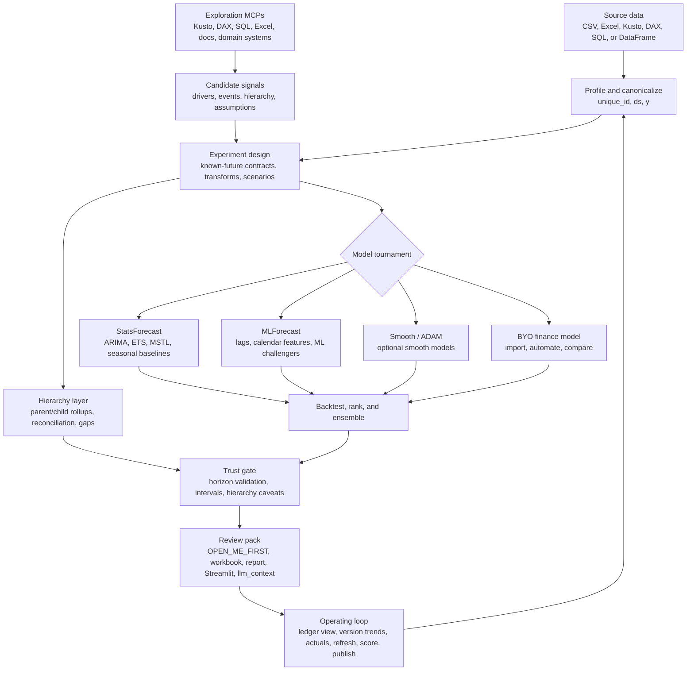

# nixtla-scaffold

[](https://pypi.org/project/nixtla-scaffold/)

Simple, explainable Nixtla forecasting scaffolding for finance users and AI agents.

`nixtla-scaffold` turns a small time-series table into forecast outputs that are easy to review, explain, and hand to another analyst or agent. It is built for the messy middle between "quick model demo" and "finance-ready operating loop": profile the data, run sensible model candidates, expose the evidence, and package the results.


## What it does

| Feature | Why it matters |
| --- | --- |
| **Fast forecast runs** | Start from a CSV or workbook with `unique_id`, `ds`, and `y`; single-series files can omit `unique_id`. |
| **Model tournament** | Runs simple baselines plus StatsForecast candidates by default, with optional MLForecast, smooth ADAM, hierarchy, custom challengers, and BYO finance models. |
| **Trust-first outputs** | Shows model evidence, interval status, horizon validation, caveats, and next actions instead of pretending every forecast is planning-ready. |
| **Finance-friendly review** | Writes a clean HTML landing page, Excel workbook, selected forecast CSV, model card, diagnostics, and Streamlit app. |
| **Exploration and experiments** | Use MCP/query sources to find candidate drivers, then test events, known-future regressors, target transforms, scenarios, and normalization factors. |
| **Hierarchy and reconciliation** | Forecast parent/child rollups, reconcile coherent totals, and surface gaps before planning use. |
| **Forecast operating loop** | Track versions, landed actuals, drift, and forecast trends over time in the ledger view. |
| **Agent handoff** | Produces `llm_context.json` for each run and ships a forecasting skill for AI agents. |

## Workbench views

| Model tournament | Prediction intervals |
| --- | --- |
|  |  |
| **Seasonality** | **Forecast review** |
|  |  |

## Five-minute forecast

Install the CLI:

```powershell
uv tool install nixtla-scaffold
```

Run a profile and forecast:

```powershell
nixtla-scaffold profile --input examples\monthly_finance_csv\input.csv
nixtla-scaffold forecast --input examples\monthly_finance_csv\input.csv --preset standard --horizon 6 --levels 80 95 --output runs\demo
```

Open `runs\demo\OPEN_ME_FIRST.html` first. It points to the clean workbook, static report, selected forecast, Streamlit app, and LLM handoff packet.

## The mental model



Think of it as a forecast workbench, not a single model. Use the right MCP or query tool to explore source data and candidate regressors, turn only trusted known-future signals into experiments, let the tournament compare statistical, ML, smooth, hierarchy, and BYO finance-model paths, then use the ledger view to track forecast versions, trends, and actuals as the operating loop matures.

## Input shape

Use a long table:

| unique_id | ds | y |
| --- | --- | --- |
| Revenue | 2024-01-31 | 100000 |
| Revenue | 2024-02-29 | 104000 |

Finance exports can keep business column names:

```powershell
nixtla-scaffold forecast --input plan.xlsx --sheet Data --id-col Product --time-col Month --target-col Revenue --preset standard --horizon 6 --output runs\plan
```

## Presets

| Preset | Use when |
| --- | --- |
| `quick` | You need a fast first read or smoke run. |
| `standard` | You need the normal serious finance forecast. |
| `strict` | The forecast feeds a high-stakes decision and should require stronger validation. |
| `hierarchy` | Parent and child planning totals need to tie. |

## Outputs to open first

| File | Use it for |
| --- | --- |
| `OPEN_ME_FIRST.html` | Clean landing page with the best next files. |
| `output\forecast_review.xlsx` | Compact workbook for analyst review. |
| `forecast.csv` | Selected forecast rows with horizon and interval guardrails. |
| `report.html` | Static review report with evidence and caveats. |
| `streamlit_app.py` | Interactive local dashboard. |
| `llm_context.json` | Single-file handoff packet for an LLM or agent. |
| `appendix\hierarchy_rollup.csv` | Parent/child rollup coverage and reconciliation gaps when hierarchy is enabled. |

## More paths

| Need | Start here |
| --- | --- |
| Agent or LLM workflow details | [`agent_overview_and_instructions.md`](agent_overview_and_instructions.md) |
| Packaged forecasting skill | [`skills\nixtla-forecast\SKILL.md`](skills/nixtla-forecast/SKILL.md) |
| Air tourism demo | [`examples\air_tourism_demo`](examples/air_tourism_demo) |
| Scenario QA battery | [`docs\scenario_test_battery.md`](docs/scenario_test_battery.md) |

## Python API

```python
from nixtla_scaffold import forecast_spec_preset, run_forecast

spec = forecast_spec_preset("standard", horizon=6, freq="ME")
run = run_forecast("data.csv", spec)
run.to_directory("runs/standard_forecast")
```

## Development

```powershell
uv sync --extra ml --extra hierarchy
uv run pytest
uv run nixtla-scaffold forecast --input examples\monthly_finance_csv\input.csv --preset quick --output runs\dev_smoke
```

Local run outputs are ignored by git so forecast experiments, reports, query artifacts, and workbooks stay out of commits.
